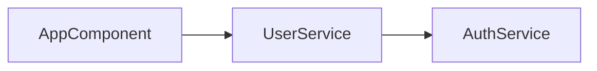

# ng-di-graph

[](package.json)
[](https://www.typescriptlang.org/)
[](#test-coverage)
[](LICENSE)

A command-line tool that analyzes Angular TypeScript codebases to extract dependency injection relationships and generate visual dependency graphs.

**Target Angular Versions:** 17-20
**Primary Runtime:** Bun 1.2+ (Node.js 18+ supported as fallback)

## Features

✨ **Complete MVP Implementation** - All 14 functional requirements (FR-01 to FR-14) fully implemented

- 🔍 **Dependency Analysis** - Extract DI relationships from `@Injectable`, `@Component`, and `@Directive` classes
- 🎯 **Constructor Injection** - Analyze constructor parameters with type annotations and `@Inject()` tokens
- 🏷️ **Decorator Flags** - Capture `@Optional`, `@Self`, `@SkipSelf`, and `@Host` parameter decorators
- 📊 **Multiple Output Formats** - JSON (machine-readable) and Mermaid (visual flowcharts)
- 🎨 **Entry Point Filtering** - Generate sub-graphs from specific starting nodes
- 🔄 **Bidirectional Analysis** - Explore upstream dependencies, downstream consumers, or both
- 🔁 **Circular Detection** - Automatically detect and report circular dependencies
- 📝 **Verbose Logging** - Detailed parsing and resolution information with timing metrics
- 🛡️ **Graceful Error Handling** - Continue processing when individual files fail
- ⚡ **High Performance** - Process medium-sized projects (<10 seconds) with memory optimization

## Quick Start

### Installation

**With Bun (Recommended):**
```bash
# Install Bun
curl -fsSL https://bun.sh/install | bash

# Install dependencies
bun install

# Run the CLI
npm run dev -- --project ./tsconfig.json --format json
```

**With Node.js:**
```bash
# Install dependencies
npm install

# Run the CLI
npm run dev:node -- --project ./tsconfig.json --format json
```

### Basic Usage

```bash
# Analyze an Angular project and output JSON
ng-di-graph --project ./my-angular-app/tsconfig.json --format json

# Generate a Mermaid flowchart
ng-di-graph --project ./tsconfig.json --format mermaid --out graph.mmd

# Analyze dependencies of a specific component
ng-di-graph --project ./tsconfig.json --entry AppComponent --format mermaid

# Show verbose logging with detailed type resolution
ng-di-graph --project ./tsconfig.json --verbose

# Include parameter decorator flags
ng-di-graph --project ./tsconfig.json --include-decorators

# Analyze upstream dependencies (who depends on this?)
ng-di-graph --project ./tsconfig.json --entry UserService --direction upstream
```

## CLI Reference

```
ng-di-graph [options]

Options:
  -p, --project <path>       Path to tsconfig.json (default: ./tsconfig.json)
  -f, --format <format>      Output format: json | mermaid (default: json)
  -e, --entry <symbol...>    Starting nodes for sub-graph filtering
  -d, --direction <dir>      Filter direction: upstream | downstream | both (default: downstream)
  --include-decorators       Include @Optional, @Self, @SkipSelf, @Host flags in output
  --out <file>               Output file path (prints to stdout if omitted)
  -v, --verbose              Show detailed parsing and resolution information
  -h, --help                 Display help information
```

### Option Details

- **`--project`**: Specifies the TypeScript configuration file to use for project analysis
- **`--format`**: Choose between JSON (structured data) or Mermaid (visual diagram)
- **`--entry`**: Filter the graph to show only dependencies related to specified symbols (supports multiple entries)
- **`--direction`**:
  - `downstream` (default): Show what the entry depends on
  - `upstream`: Show what depends on the entry
  - `both`: Show both upstream and downstream dependencies
- **`--include-decorators`**: Add parameter decorator information to edge flags
- **`--out`**: Save output to a file instead of stdout
- **`--verbose`**: Enable detailed logging including timing metrics, memory usage, and type resolution details

## Output Formats

### JSON Format

```json
{
  "nodes": [
    { "id": "AppComponent", "kind": "component" },
    { "id": "UserService", "kind": "service" },
    { "id": "AuthService", "kind": "service" }
  ],
  "edges": [
    {
      "from": "AppComponent",
      "to": "UserService",
      "flags": { "optional": false }
    },
    {
      "from": "UserService",
      "to": "AuthService",
      "flags": { "optional": true, "self": false }
    }
  ],
  "circularDependencies": []
}
```

**Node Kinds:**
- `service` - Classes decorated with `@Injectable()`
- `component` - Classes decorated with `@Component()`
- `directive` - Classes decorated with `@Directive()`
- `unknown` - Could not determine decorator type

**Edge Flags** (when `--include-decorators` is used):
- `optional` - Parameter has `@Optional()` decorator
- `self` - Parameter has `@Self()` decorator
- `skipSelf` - Parameter has `@SkipSelf()` decorator
- `host` - Parameter has `@Host()` decorator

### Mermaid Format



Mermaid diagrams can be:
- Rendered in GitHub/GitLab markdown
- Viewed in the [Mermaid Live Editor](https://mermaid.live/)
- Embedded in documentation sites
- Converted to images using CLI tools

## Architecture

```
┌─────────────────────────────────────────────────────────┐
│                     CLI Interface                        │
│                   (Commander.js)                         │
└────────────────┬────────────────────────────────────────┘
                 │
                 ▼
┌─────────────────────────────────────────────────────────┐
│                  AngularParser                           │
│              (ts-morph AST parsing)                      │
│  • Discover decorated classes                           │
│  • Analyze constructor parameters                       │
│  • Resolve dependency tokens                            │
│  • Extract parameter decorators                         │
└────────────────┬────────────────────────────────────────┘
                 │
                 ▼
┌─────────────────────────────────────────────────────────┐
│                  GraphBuilder                            │
│           (In-memory graph construction)                 │
│  • Build nodes and edges                                │
│  • Detect circular dependencies                         │
│  • Apply entry point filtering                          │
└────────────────┬────────────────────────────────────────┘
                 │
                 ▼
┌─────────────────────────────────────────────────────────┐
│              Output Formatters                           │
│        • JSON Serialization                              │
│        • Mermaid Flowchart Generation                    │
└─────────────────────────────────────────────────────────┘
```

### Technology Stack

- **[ts-morph](https://ts-morph.com/)** (v21.0.0) - TypeScript compiler API wrapper for AST parsing
- **[Commander.js](https://github.com/tj/commander.js)** (v11.0.0) - CLI argument parsing
- **[Bun](https://bun.sh)** (1.2+) - High-performance JavaScript runtime (primary)
- **[TypeScript](https://www.typescriptlang.org/)** (v5.0) - Type-safe implementation
- **[Biome](https://biomejs.dev/)** (v1.8.0) - Fast linting and formatting

## Development

### Prerequisites

- **Bun 1.2+** (recommended) or **Node.js 18+**
- **TypeScript 5.0+**
- Angular project with TypeScript (versions 17-20 supported)

### Setup Development Environment

```bash
# Clone the repository
git clone <repository-url>
cd ng-di-graph

# Install dependencies (Bun)
bun install

# Or with npm
npm install

# Run tests in watch mode (TDD workflow)
npm run test:watch

# Run all tests
npm run test

# Check code quality
npm run check
```

### Available Scripts

**Development:**
- `npm run dev` - Run CLI with Bun (fast startup)
- `npm run dev:node` - Run CLI with Node.js & ts-node
- `npm run test` - Run full test suite (395 tests)
- `npm run test:watch` - Watch mode for TDD development
- `npm run test:coverage` - Generate coverage report

**Code Quality:**
- `npm run lint` - Check code with Biome
- `npm run lint:fix` - Auto-fix Biome issues
- `npm run format` - Format code with Biome
- `npm run check` - Combined lint & typecheck
- `npm run typecheck` - TypeScript type checking
- `npm run typecheck:bun` - TypeScript via Bun

**Build:**
- `npm run build` - Build with Bun bundler (sub-second builds)
- `npm run build:node` - Build with TypeScript compiler
- `npm run clean` - Remove dist directory

### Test Coverage

The project maintains high test coverage with comprehensive test suites:

- **Total Tests:** 395 passing
- **Function Coverage:** 93.28%
- **Line Coverage:** 99.06%
- **Test Execution Time:** ~62 seconds

**Coverage by Module:**
- `parser.ts` - 97.78% (comprehensive decorator & token tests)
- `graph-builder.ts` - 100%
- `formatters` - 100%
- `graph-filter.ts` - 100%
- `logger.ts` - 100%
- `error-handler.ts` - 81.82% (edge case handling)

### Test-Driven Development

This project follows strict TDD methodology:

1. **Write failing tests first** using `npm run test:watch`
2. **Implement minimal code** to pass tests
3. **Refactor** while keeping tests green
4. **Maintain high coverage** (>90% target)

See [TDD Development Workflow](docs/instructions/tdd-development-workflow.md) for detailed guidelines.

## Performance

### Benchmarks

- **Startup Time (Bun):** ~0.6 seconds
- **Startup Time (Node.js):** ~1.3 seconds
- **Medium Project (<500 files):** <10 seconds
- **Memory Usage:** Optimized for large codebases
- **Build Time:** <1 second (Bun bundler)

### Performance Features

- Parallel file processing where possible
- Efficient AST traversal with ts-morph
- Memory-optimized graph construction
- Streaming output for large graphs
- Built-in performance metrics (with `--verbose`)

## Project Documentation

The project includes comprehensive documentation:

- **[CLAUDE.md](CLAUDE.md)** - AI development instructions and project overview
- **[MVP Requirements](docs/prd/mvp-requirements.md)** - Complete product requirements document
- **[AI Development Guide](docs/rules/ai-development-guide.md)** - AI-assisted development best practices
- **[TDD Workflow](docs/instructions/tdd-development-workflow.md)** - Test-driven development methodology

## Use Cases

### 1. Test Planning
Quickly identify all dependencies of a component to plan test mocks:
```bash
ng-di-graph --project ./tsconfig.json --entry MyComponent --format json
```

### 2. Impact Analysis
Find all consumers of a service before making breaking changes:
```bash
ng-di-graph --project ./tsconfig.json --entry UserService --direction upstream
```

### 3. Documentation
Generate visual dependency diagrams for README or design docs:
```bash
ng-di-graph --project ./tsconfig.json --format mermaid --out docs/architecture.mmd
```

### 4. Circular Dependency Detection
Identify circular dependencies in your DI graph:
```bash
ng-di-graph --project ./tsconfig.json --verbose
# Check the "circularDependencies" array in output
```

### 5. Debugging Type Issues
Investigate type resolution problems with verbose logging:
```bash
ng-di-graph --project ./tsconfig.json --verbose
# Shows detailed type resolution and warnings
```

## Error Handling

The tool provides graceful error handling:

- **File Parsing Failures** - Skips unparseable files and continues processing
- **Type Resolution Issues** - Logs warnings for `any`/`unknown` types
- **Missing tsconfig.json** - Clear error message with suggestion
- **Invalid CLI Arguments** - Help message with usage examples
- **Circular Dependencies** - Detected and reported without blocking analysis
- **Memory Constraints** - Suggestions for chunking large codebases

Exit codes:
- `0` - Success
- `1` - Fatal error (invalid config, parsing failure, etc.)

## Contributing

Contributions are welcome! Please follow these guidelines:

1. **Follow TDD methodology** - Write tests first, then implementation
2. **Maintain test coverage** - Ensure >90% coverage for new code
3. **Use Biome for linting** - Run `npm run lint:fix` before committing
4. **Type safety** - All code must pass `npm run typecheck`
5. **Run full test suite** - Ensure `npm run test` passes
6. **Follow existing patterns** - Review existing code structure

See [AI Development Guide](docs/rules/ai-development-guide.md) for detailed development workflow.

## Roadmap

Future enhancements being considered:

- Generic type parameter handling (`Service<T>`)
- Angular module boundary visualization
- Provider array parsing (`useClass`, `useFactory`, `useValue`)
- `forwardRef` resolution
- `InjectionToken` definition analysis
- Stand-alone component provider composition
- Additional output formats (DOT, PlantUML)
- VS Code extension
- Web UI for interactive graph exploration
- Nx workspace integration
- ESLint plugin for DI best practices

## License

MIT License - See [LICENSE](LICENSE) file for details

## Version

Current version: **0.1.0 (MVP)**

All 14 functional requirements (FR-01 to FR-14) are complete and production-ready.

---

**Built with ⚡ [Bun](https://bun.sh) for optimal performance**
