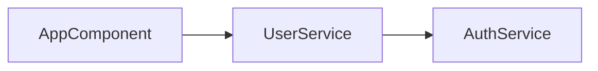

# ng-di-graph

[](https://github.com/m-yoshiro/ng-di-graph/actions/workflows/ci.yml)
[](package.json)
[](LICENSE)

A command-line tool that analyzes Angular TypeScript codebases to extract dependency injection relationships.

**Target Angular Versions:** 17-20

## Requirements

- Node.js 20.x LTS (see `.node-version`; e.g., `mise use node@$(cat .node-version)`)
- npm 10+ (ships with Node 20). Use your preferred version manager (mise recommended) to match the pinned runtime before installing dependencies.

## Features

✨ **Complete Feature Set** - Production-ready dependency graph analysis for Angular applications

- 🔍 **Dependency Analysis** - Extract DI relationships from `@Injectable`, `@Component`, and `@Directive` classes
- 🎯 **Constructor Injection** - Analyze constructor parameters with type annotations and `@Inject()` tokens
- 🏷️ **Decorator Flags** - Capture `@Optional`, `@Self`, `@SkipSelf`, and `@Host` parameter decorators
- 📊 **Multiple Output Formats** - JSON (machine-readable) and Mermaid (visual flowcharts)
- 🎨 **Entry Point Filtering** - Generate sub-graphs from specific starting nodes
- 🔄 **Bidirectional Analysis** - Explore upstream dependencies, downstream consumers, or both
- 🔁 **Circular Detection** - Automatically detect and report circular dependencies

## Installation

```bash
npm install -g ng-di-graph
```

## Usage

```bash
# Analyze an Angular project and output JSON
ng-di-graph --project ./my-angular-app/tsconfig.json --format json

# Generate a Mermaid flowchart
ng-di-graph --project ./tsconfig.json --format mermaid --out graph.mmd

# Analyze dependencies of a specific component
ng-di-graph --project ./tsconfig.json --entry AppComponent --format mermaid

# Show verbose logging with detailed type resolution
ng-di-graph --project ./tsconfig.json --verbose

# Include parameter decorator flags
ng-di-graph --project ./tsconfig.json --include-decorators

# Analyze upstream dependencies (who depends on this?)
ng-di-graph --project ./tsconfig.json --entry UserService --direction upstream
```

## CLI Reference

```
ng-di-graph [options]

Options:
  -p, --project <path>       Path to tsconfig.json (default: ./tsconfig.json)
  -f, --format <format>      Output format: json | mermaid (default: json)
  -e, --entry <symbol...>    Starting nodes for sub-graph filtering
  -d, --direction <dir>      Filter direction: upstream | downstream | both (default: downstream)
  --include-decorators       Include @Optional, @Self, @SkipSelf, @Host flags in output
  --out <file>               Output file path (prints to stdout if omitted)
  -v, --verbose              Show detailed parsing and resolution information
  -h, --help                 Display help information
```

### Option Details

- **`--project`**: Specifies the TypeScript configuration file to use for project analysis
- **`--format`**: Choose between JSON (structured data) or Mermaid (visual diagram)
- **`--entry`**: Filter the graph to show only dependencies related to specified symbols (supports multiple entries)
- **`--direction`**:
  - `downstream` (default): Show what the entry depends on
  - `upstream`: Show what depends on the entry
  - `both`: Show both upstream and downstream dependencies
- **`--include-decorators`**: Add parameter decorator information to edge flags
- **`--out`**: Save output to a file instead of stdout
- **`--verbose`**: Enable detailed logging including timing metrics, memory usage, and type resolution details

## Output Formats

### JSON Format

```json
{
  "nodes": [
    { "id": "AppComponent", "kind": "component" },
    { "id": "UserService", "kind": "service" },
    { "id": "AuthService", "kind": "service" }
  ],
  "edges": [
    {
      "from": "AppComponent",
      "to": "UserService",
      "flags": { "optional": false }
    },
    {
      "from": "UserService",
      "to": "AuthService",
      "flags": { "optional": true, "self": false }
    }
  ],
  "circularDependencies": []
}
```

**Node Kinds:**
- `service` - Classes decorated with `@Injectable()`
- `component` - Classes decorated with `@Component()`
- `directive` - Classes decorated with `@Directive()`
- `unknown` - Could not determine decorator type

**Edge Flags** (when `--include-decorators` is used):
- `optional` - Parameter has `@Optional()` decorator
- `self` - Parameter has `@Self()` decorator
- `skipSelf` - Parameter has `@SkipSelf()` decorator
- `host` - Parameter has `@Host()` decorator

### Mermaid Format



Mermaid diagrams can be:
- Rendered in GitHub/GitLab markdown
- Viewed in the [Mermaid Live Editor](https://mermaid.live/)
- Embedded in documentation sites
- Converted to images using CLI tools

## Use Cases

### 1. Test Planning
Quickly identify all dependencies of a component to plan test mocks:
```bash
ng-di-graph --project ./tsconfig.json --entry MyComponent --format json
```

### 2. Impact Analysis
Find all consumers of a service before making breaking changes:
```bash
ng-di-graph --project ./tsconfig.json --entry UserService --direction upstream
```

### 3. Documentation
Generate visual dependency diagrams for README or design docs:
```bash
ng-di-graph --project ./tsconfig.json --format mermaid --out docs/architecture.mmd
```

### 4. Circular Dependency Detection
Identify circular dependencies in your DI graph:
```bash
ng-di-graph --project ./tsconfig.json --verbose
# Check the "circularDependencies" array in output
```

### 5. Debugging Type Issues
Investigate type resolution problems with verbose logging:
```bash
ng-di-graph --project ./tsconfig.json --verbose
# Shows detailed type resolution and warnings
```

## Error Handling

The tool provides graceful error handling:

- **File Parsing Failures** - Skips unparseable files and continues processing
- **Type Resolution Issues** - Logs warnings for `any`/`unknown` types
- **Missing tsconfig.json** - Clear error message with suggestion
- **Invalid CLI Arguments** - Help message with usage examples
- **Circular Dependencies** - Detected and reported without blocking analysis
- **Memory Constraints** - Suggestions for chunking large codebases

Exit codes:
- `0` - Success
- `1` - Fatal error (invalid config, parsing failure, etc.)

## Contributing

Contributions are welcome! Please see our [Contributing Guide](CONTRIBUTING.md) for development setup, code quality standards, and the pull request process.

## License

MIT License - See [LICENSE](LICENSE) file for details

## Version

Current version: **0.1.0**

All core features are complete and production-ready.
