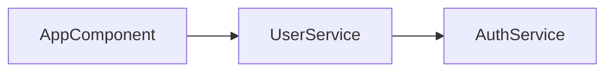

# ng-di-graph

[](https://github.com/m-yoshiro/ng-di-graph/actions/workflows/ci.yml)
[](package.json)
[](LICENSE)

A command-line tool that analyzes Angular TypeScript codebases to extract dependency injection relationships.

**Target Angular Versions:** 17-20

## Prerequisites
- Node.js 20.x (npm 10+)
- Angular project targeting v17-20 with a `tsconfig.json` to discover or reference

## Installation
```bash
npm install -g ng-di-graph
```

## Quick start
```bash
# Analyze the whole project and print JSON (auto-discover tsconfig)
ng-di-graph --format json

# Generate a Mermaid diagram and save it
ng-di-graph --format mermaid --out docs/di-graph.mmd

# Target specific files via positional filePaths
ng-di-graph src/app/app.component.ts src/app/auth.service.ts --format json

# Auto-discover the nearest tsconfig.json (no --project needed)
ng-di-graph src/app --format mermaid --out docs/di-graph.mmd

# Focus on a symbol and see who depends on it
ng-di-graph --entry UserService --direction upstream

# Override auto-discovery with an explicit tsconfig
ng-di-graph --project ./tsconfig.json --format json
```

## Features

✨ **Complete Feature Set** - Production-ready dependency graph analysis for Angular applications

- 🔍 **Dependency Analysis** - Extract DI relationships from `@Injectable`, `@Component`, and `@Directive` classes
- 🎯 **Constructor Injection** - Analyze constructor parameters with type annotations and `@Inject()` tokens
- 🏷️ **Decorator Flags** - Capture `@Optional`, `@Self`, `@SkipSelf`, and `@Host` parameter decorators
- 📊 **Multiple Output Formats** - JSON (machine-readable) and Mermaid (visual flowcharts)
- 🎨 **Entry Point Filtering** - Generate sub-graphs from specific starting nodes
- 🔄 **Bidirectional Analysis** - Explore upstream dependencies, downstream consumers, or both
- 🔁 **Circular Detection** - Automatically detect and report circular dependencies

## Common commands
- Full project, JSON output:  
  `ng-di-graph --format json`
- Mermaid diagram to file:  
  `ng-di-graph --format mermaid --out docs/di-graph.mmd`
- Filter to specific symbols:  
  `ng-di-graph --entry AppComponent`
- Upstream consumers of a service:  
  `ng-di-graph --entry UserService --direction upstream`
- Include decorator flags with verbose logging:  
  `ng-di-graph --include-decorators --verbose`

## CLI options at a glance

```
ng-di-graph [filePaths...] [options]
```

Option | Default | Description
-- | -- | --
`filePaths` | none | Positional alias for `--files`; combines with `--files` when both are set.
`-p, --project <path>` | auto-discovered | Path to the TypeScript config file to analyze (omit to auto-discover).
`--files <paths...>` | none | Limit analysis to specific files or directories.
`-f, --format <format>` | `json` | Output as `json` or `mermaid`.
`-e, --entry <symbol...>` | none | Start the graph from one or more symbols.
`-d, --direction <dir>` | `downstream` | `downstream`, `upstream`, or `both` relative to entries.
`--include-decorators` | `false` | Add `@Optional`, `@Self`, `@SkipSelf`, `@Host` flags to edges.
`--out <file>` | stdout | Write output to a file.
`-v, --verbose` | `false` | Show detailed parsing and resolution logs.
`-h, --help` | `false` | Display CLI help.

## Output Formats

### JSON Format

```json
{
  "nodes": [
    {
      "id": "AppComponent",
      "kind": "component",
      "source": { "filePath": "/path/to/src/app.component.ts", "line": 12, "column": 14 }
    },
    {
      "id": "UserService",
      "kind": "service",
      "source": { "filePath": "/path/to/src/user.service.ts", "line": 8, "column": 14 }
    },
    {
      "id": "AuthService",
      "kind": "service",
      "source": { "filePath": "/path/to/src/auth.service.ts", "line": 20, "column": 14 }
    },
    {
      "id": "Logger",
      "kind": "service",
      "source": { "filePath": "/path/to/src/logger.service.ts", "line": 5, "column": 14 }
    }
  ],
  "edges": [
    {
      "from": "AppComponent",
      "to": "UserService"
    },
    {
      "from": "UserService",
      "to": "AuthService",
      "flags": { "optional": true, "self": false, "skipSelf": false, "host": false }
    },
    {
      "from": "AuthService",
      "to": "Logger",
      "flags": { "optional": false, "self": false, "skipSelf": false, "host": false }
    }
  ],
  "circularDependencies": [["UserService", "AuthService", "UserService"]]
}
```

**Node Kinds:**
- `service` - Classes decorated with `@Injectable()`
- `component` - Classes decorated with `@Component()`
- `directive` - Classes decorated with `@Directive()`
- `unknown` - Could not determine decorator type

**Node Source** (when available):
- `source.filePath` - Absolute file path reported by the TypeScript project
- `source.line` / `source.column` - 1-based position of the class name token
- `source` is omitted for `unknown` nodes created from unresolved tokens

**Edge Flags** (when `--include-decorators` is used):
- `optional` - Parameter has `@Optional()` decorator
- `self` - Parameter has `@Self()` decorator
- `skipSelf` - Parameter has `@SkipSelf()` decorator
- `host` - Parameter has `@Host()` decorator

### Mermaid Format


```mermaid
flowchart LR
  AppComponent --> UserService
  UserService --> AuthService
```

Mermaid diagrams can be rendered in GitHub/GitLab markdown, viewed in the [Mermaid Live Editor](https://mermaid.live/), or converted to images with CLI tools.

## Use cases
- Test planning: surface dependencies to decide what to mock.
- Impact analysis: list consumers before changing a service.
- Documentation: add Mermaid diagrams to READMEs or architecture docs.

## Release workflow
Releases are automated via Release Please; tag pushes run lint → typecheck → test → build → pack → publish. Maintainer runbook: see `docs/release/ci-publish.md`.

## Error handling
The CLI reports clear failures and continues past unparseable files; rerun with `--verbose` for detailed logs.

## Contributing

Contributions are welcome! Please see our [Contributing Guide](CONTRIBUTING.md) for development setup, code quality standards, and the pull request process.

## License

MIT License - See [LICENSE](LICENSE) file for details
