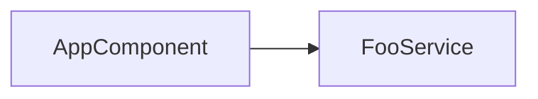

# Angular DI Dependency Graph CLI — MVP Requirements

- **Project Name**: **ng‑di‑graph** (working title)
- **Document Version**: **v0.1‑MVP**
- **Created**: 2025‑07‑29
- **Target Angular Versions**: **17 – 20**

---

## 0. Distribution & Installation

### 0.1 Global NPM Package Requirements

The tool must be installable and executable globally via npm:

```bash
npm install -g ng-di-graph
ng-di-graph --help
```

#### 0.1.1 Package Configuration Requirements

| Requirement | Implementation | Status |
|------------|----------------|---------|
| **Executable Entry Point** | `bin` field in package.json pointing to `dist/cli/index.js` | ✅ Configured |
| **Shebang Line** | `#!/usr/bin/env node` at top of CLI entry file | ✅ Present |
| **Published Files** | `files` field limiting npm package to `dist/` directory only | ✅ Configured |
| **Pre-publish Build** | `prepublishOnly` script to auto-build before publishing | ✅ Configured |
| **Executable Permissions** | Git tracking of executable bit on CLI entry file | ✅ Configured |
| **Node.js Compatibility** | Build output targets Node.js runtime (current: Node.js bundle) | ✅ Configured |

#### 0.1.2 Distribution Strategy

**Selected Approach: Node.js-Compatible Bundle**

The tool compiles TypeScript to Node.js-compatible JavaScript:
- **Runtime**: Requires Node.js ≥20.0.0 (documented via `.node-version` for mise users)
- **Build Output**: Single bundled JavaScript file with dependencies
- **Package Size**: Small (~100KB estimated)
- **Compatibility**: Works on any system with Node.js installed
- **Development Tool**: Currently migrating from Bun helpers to an npm-first workflow while continuing to run on Node.js for distribution

**Rejected Alternative: Bun Standalone Executable**
- Would require `bun build --compile` creating platform-specific binaries
- Large package size (~30-50MB with embedded runtime)
- Platform-specific builds required for cross-platform support
- Not suitable for npm distribution model

#### 0.1.3 Local Testing Workflow

Before publishing to npm, developers must test global installation locally:

```bash
# 1. Build the project
npm run build

# 2. Create global symlink
npm link

# 3. Test from any directory
ng-di-graph --help
ng-di-graph -p ./tsconfig.json -f json

# 4. Cleanup when done
npm unlink -g ng-di-graph
```

#### 0.1.4 Publishing Requirements

| Step | Command | Description |
|------|---------|-------------|
| **Version Update** | Manual edit of `package.json` | Update semantic version |
| **Pre-publish Build** | Auto-runs via `prepublishOnly` | Ensures fresh compiled code |
| **Publish** | `npm publish` | Upload to npm registry |
| **Verification** | `npm info ng-di-graph` | Confirm published successfully |

---

## 1. Background & Purpose
Unit testing in Angular often requires a clear understanding of which services, components, or directives are injected into one another. Manually mapping these dependencies is time‑consuming and error‑prone.
The goal of this project is to deliver a **command‑line tool** that parses a TypeScript codebase with *ts‑morph*, extracts constructor‑based DI dependencies, and outputs a lightweight graph. This first iteration focuses on the minimum features required to make that workflow viable.

---

## 2. Scope

### 2.1 In Scope (MVP)
| Item | Details |
|------|---------|
| **Decorated classes** | `@Injectable()`, `@Component()`, `@Directive()` |
| **Dependency source** | Constructor parameter **type annotations** or `@Inject(TOKEN)` |
| **Parameter decorators** | Detect `@Optional`, `@Self`, `@SkipSelf`, `@Host`; store as edge flags |
| **Output formats** | **JSON** (machine‑readable) and **Mermaid flowchart** (visual) |
| **CLI options** | `--project`, `--format`, `--entry`, `--out`, `--include-decorators` |
| **Entry filtering** | Generate a sub‑graph starting from one or more specified symbols |

### 2.2 Out of Scope
* `providers` array parsing (`useClass`, `useValue`, `useFactory`, `useExisting`, `multi`, …)
* `InjectionToken` definition resolution or generics analysis
* `forwardRef` handling
* Stand‑alone provider composition (`importProvidersFrom()`, `EnvironmentInjector`, etc.)
* Runtime instrumentation or Injector patching
* Visual diff tooling, VS Code extension, Nx/ESLint integration — all deferred

---

## 3. Glossary
| Term | Definition |
|------|------------|
| **DI** | Dependency Injection in Angular |
| **Token** | Identifier used by the injector (class, `InjectionToken`, string, etc.) |
| **Node** | Vertex in the dependency graph |
| **Edge** | Directed link `from → to` between two nodes |
| **Entry** | Starting node used to limit the generated graph |
| **MVP** | Minimum Viable Product |

---

## 4. Users & Use‑cases

### 4.1 Users
* Front‑end & test engineers
* Architects / code‑base maintainers

### 4.2 Typical Workflows
1. **Mock Planning** – list all dependencies of a component or service to decide what to mock.
2. **Impact Analysis** – find consumers of a service before making breaking changes.
3. **Documentation** – embed a Mermaid diagram in README or design docs.

---

## 5. Assumptions & Constraints
* A valid `tsconfig.json` is present.
* The codebase compiles (type information is required).
* Decorators are applied correctly; `emitDecoratorMetadata` is **not** required.
* The CLI runs in a Node.js environment across OSes.

---

## 6. Functional Requirements

| ID | Requirement |
|----|-------------|
| **FR‑01** | Parse the `--project` tsconfig and load its program with **ts‑morph**. |
| **FR‑02** | Collect all classes decorated with `@Injectable`, `@Component`, or `@Directive`. |
| **FR‑03** | For each constructor parameter, resolve the token from its type or `@Inject`. |
| **FR‑04** | Record parameter decorators (`Optional`, `Self`, …) as edge flags when `--include-decorators` is set. |
| **FR‑05** | Build an in‑memory graph; expose it as **JSON** and **Mermaid**. |
| **FR‑06** | Support `--format json|mermaid` (default `json`). |
| **FR‑07** | Support `--entry` for sub‑graph extraction via DFS/BFS. |
| **FR‑08** | Write to stdout or a file path supplied by `--out`. |
| **FR‑09** | Skip dependencies whose type resolves to `any`/`unknown`; log a warning. |
| **FR‑10** | Exit with a non‑zero code and a clear error message on fatal failures. |
| **FR‑11** | Detect and report circular dependencies in the dependency graph. |
| **FR‑12** | Support `--verbose` mode for detailed type resolution debugging information. |
| **FR‑13** | Support bidirectional entry filtering with `--direction upstream\|downstream\|both`. |
| **FR‑14** | Continue processing when individual files fail to parse (graceful error recovery). |

---

## 7. Non‑Functional Requirements

| ID | Requirement |
|----|-------------|
| **NFR‑01** | Complete on a medium‑sized project (hundreds of files) within ~10 seconds. |
| **NFR‑02** | Depend only on **ts‑morph** (no Angular internal APIs) for stability. |
| **NFR‑03** | CI‑friendly; no OS‑specific assumptions. |
| **NFR‑04** | Unit tests cover >70 % of core logic. |

---

## 8. Input Specification
* **Required**: `--project <tsconfig path>`
* **Optional**:
  * `--entry <symbol...>`
  * `--format json|mermaid`
  * `--out <file>`
  * `--include-decorators`

---

## 9. Output Specification

### 9.1 JSON
```json
{
  "nodes": [
    { "id": "FooService", "kind": "service" },
    { "id": "AppComponent", "kind": "component" }
  ],
  "edges": [
    { "from": "AppComponent", "to": "FooService", "flags": { "optional": false } }
  ]
}
```

### 9.2 Mermaid

*Node names are used verbatim; escaping may be required for duplicates or special characters.*

---

## 10. Data Model (TypeScript)

```ts
type NodeKind = 'service' | 'component' | 'directive' | 'unknown';

interface Node {
  id: string;
  kind: NodeKind;
}

interface EdgeFlags {
  optional?: boolean;
  self?: boolean;
  skipSelf?: boolean;
  host?: boolean;
}

interface Edge {
  from: string;
  to: string;
  flags?: EdgeFlags;
  isCircular?: boolean;
}

interface Graph {
  nodes: Node[];
  edges: Edge[];
  circularDependencies: string[][];
}
```

---

## 11. CLI Interface

```text
ng-di-graph [options]

Options:
  -p, --project <path>       tsconfig.json path (default: ./tsconfig.json)
  -f, --format <format>      json | mermaid (default: json)
  -e, --entry <symbol...>    one or more starting nodes
  -d, --direction <dir>      entry filtering direction: upstream|downstream|both (default: downstream)
  --include-decorators       include Optional/Self/SkipSelf/Host flags
  --out <file>               output file (stdout if omitted)
  -v, --verbose              show detailed parsing and resolution information
  -h, --help                 show help
```

---

## 12. Processing Flow

1. Parse CLI arguments.
2. Load the TS project via **ts‑morph**.
3. Discover decorated classes.
4. Analyse each constructor for dependencies and flags.
5. Build the graph (`nodes`, `edges`).
6. If `--entry` is set, prune to a downstream sub‑graph.
7. Render in the selected format.
8. Write to stdout or a file.

---

## 13. Error Handling

| Situation | Behaviour |
|-----------|-----------|
| Missing/invalid tsconfig | Abort, exit 1, print error. |
| No decorated classes found | Print warning, exit 0. |
| Anonymous class | Skip and warn. |
| Type resolution failed | Skip dependency and warn. |
| File parsing failure | Skip file, warn, continue processing. |
| Circular dependency detected | Report in output, continue processing. |
| Memory constraints on large codebases | Suggest chunking strategies in error message. |
| Uncaught exception | Print stack trace, exit 1. |

---

## 14. Test Plan

### Unit Tests
* **TC‑01** Service → Service dependency (JSON).
* **TC‑02** Component → Service (Mermaid).
* **TC‑03** `@Inject(TOKEN)` token resolution.
* **TC‑04** Optional flag appears only with `--include-decorators`.
* **TC‑05** Entry filtering.
* **TC‑06** Unknown types are skipped without crash.
* **TC‑07** Circular dependency detection and reporting.
* **TC‑08** Verbose mode outputs detailed parsing information.
* **TC‑09** Upstream dependency filtering works correctly.
* **TC‑10** Graceful handling of unparseable files.

### Acceptance Criteria
* Meets **FR‑01** – **FR‑14**.
* Mermaid passes the Live Editor check.
* Completes on a sample Angular repo (<10 s).
* `ng-di-graph --help` lists all options.

---

## 15. Risks & Mitigations

| Risk | Impact | Mitigation |
|------|--------|------------|
| Undecorated classes not analysed | Missing edges | Acceptable in MVP; plan to add provider parsing later. |
| `any`/`unknown` hides dependencies | Partial graph | Warn users; can be corrected in code. |
| ts‑morph / TS version drift | Parse errors | Lock dependency versions; test in CI. |
| Duplicate node names | Diagram breaks | Escape or prefix with file path (TBD). |
| Large codebases may exceed memory limits | Tool failure or slow performance | Implement chunking strategies and memory-efficient parsing. |

---

## 16. Future Enhancements

* Generic type parameter handling (`Service<T>`).
* Angular module boundary visualization.
* Memory optimization for enterprise‑scale codebases.
* Parse `providers` arrays (`useClass`, `useFactory`, …).
* Handle `forwardRef`.
* Analyse `InjectionToken` definitions.
* Support Stand‑alone provider composition.
* Graph diffs & PR comments.
* VS Code extension / Web UI.
* Nx, ESLint, or Angular builder integrations.
* Additional output formats: DOT, PlantUML, etc.

---

## 17. Tentative Timeline

| Phase | Deliverable | Duration |
|-------|-------------|----------|
| Requirements approval | This document | 0.5 day |
| Design & skeleton | Types, module layout, CLI shell | 1 day |
| Implementation | AST parsing → output | 2–3 days |
| Test & tuning | Unit tests, sample repo | 1 day |
| Docs | README & examples | 0.5 day |
