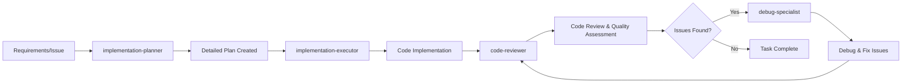

# AI Development Guide for ng-di-graph

**Version**: 1.0  
**Project**: ng-di-graph Angular DI Dependency Graph CLI  
**Last Updated**: 2025-07-31  
**Methodology**: AI-Assisted Test-Driven Development

---

## 1. AI-Powered Development Overview

This guide outlines how to effectively leverage Claude Code's specialized agents to develop the ng-di-graph CLI tool. The project uses four specialized agents that work together to provide a complete development workflow:

- **implementation-planner**: Transforms requirements into structured, executable plans
- **implementation-executor**: Executes plans with precision and best practices
- **code-reviewer**: Performs comprehensive code review and quality assurance for recently written code
- **debug-specialist**: Performs code analysis, debugging, and error resolution

### Core Principles
- **Incremental Development**: Focus on one task at a time for better quality and maintainability
- **TDD Integration**: All AI-assisted development must follow the mandatory TDD workflow
- **Clear Task Boundaries**: Define specific, achievable scope for each AI interaction
- **Quality Over Speed**: Prioritize thorough completion over rapid iteration

---

## 2. Agent Workflow Integration

### 2.1 When to Use Each Agent

| Agent | Use Case | Example |
|-------|----------|---------|
| **implementation-planner** | Creating detailed implementation plans from PRD requirements | "Break down FR-01 (ts-morph project loading) into executable tasks" |
| **implementation-executor** | Executing existing implementation plans with code | "Implement the CLI interface plan we created yesterday" |
| **code-reviewer** | Comprehensive code review and quality assurance for recently written code | "Review my Angular parser implementation for quality, standards compliance, and potential improvements" |
| **debug-specialist** | Code analysis, debugging, and error resolution | "Debug these type errors and fix the failing tests" |

### 2.2 Typical Workflow Sequence



### 2.3 Agent Handoff Best Practices

1. **Complete Previous Stage**: Ensure current agent has fully completed their task before switching
2. **Clear Context Transfer**: Provide the next agent with complete context and references
3. **Document Progress**: Update todo lists and progress tracking between agent switches
4. **Validate Outputs**: Verify each agent's output meets acceptance criteria before proceeding
5. **Code Review Integration**: Always use code-reviewer after implementation before considering a task complete
6. **Issue Resolution**: Use debug-specialist to address specific issues identified by code-reviewer

---

## 3. TDD with AI Assistance

### 3.1 Mandatory TDD Cycle with AI

Every feature implementation must follow this enhanced TDD cycle:

```
1. RED (with AI): Use implementation-planner to design failing tests
2. GREEN (with AI): Use implementation-executor to write minimal passing code  
3. REVIEW (with AI): Use code-reviewer to assess code quality and standards compliance
4. REFACTOR (with AI): Use debug-specialist to optimize and resolve any identified issues
5. REPEAT: Continue cycle until feature complete
```

### 3.2 Test-First Development Commands

Always use these commands during TDD development:
```bash
# Start TDD session
npm run test:watch

# Validate implementation
npm run lint
npm run typecheck
npm run test
```

### 3.3 AI-Enhanced Testing Strategy

- **Test Design**: Use implementation-planner to create comprehensive test cases before coding
- **Test Implementation**: Use implementation-executor to write actual test code following TDD principles
- **Code Review**: Use code-reviewer to assess test quality, coverage, and adherence to testing best practices
- **Test Optimization**: Use debug-specialist to ensure tests are robust and cover edge cases

---

## 4. Task Scoping and Management

### 4.1 The Problem with Large Scope

**❌ Don't Do This:**
- "Implement the entire parser, graph builder, and CLI interface at once"
- "Create all FR-01 through FR-14 functionality in one session"
- "Build the complete application with all features"

**✅ Do This Instead:**
- "Implement FR-01: ts-morph project loading with comprehensive error handling"
- "Create the AngularParser.findDecoratedClasses() method with full test coverage"
- "Add CLI argument parsing for --project and --format options"

### 4.2 Effective Task Scoping Principles

#### 4.2.1 Single Responsibility Focus
Each AI interaction should focus on ONE specific functionality:
- One functional requirement (FR-01, FR-02, etc.)
- One class method implementation
- One CLI option group
- One test suite completion

#### 4.2.2 Time-Boxed Development
Structure tasks to be completable in focused sessions:
- **Small Tasks**: 15-30 minutes (single method, simple feature)
- **Medium Tasks**: 1-2 hours (complete functional requirement)
- **Large Tasks**: Half-day maximum (complex feature with full testing)

#### 4.2.3 Clear Entry and Exit Criteria
Each task should have:
- **Entry Criteria**: What must be ready before starting
- **Deliverables**: Specific outputs expected
- **Exit Criteria**: How to know the task is complete
- **Acceptance Tests**: Validation steps to confirm success

### 4.3 Task Boundary Examples

#### ✅ Well-Scoped Task Example
```
Task: Implement FR-02 - Decorated Class Collection
Scope: AngularParser.findDecoratedClasses() method only
Entry: ts-morph project loading is working
Deliverables: 
  - Method implementation with TypeScript types
  - Complete test suite with 90%+ coverage
  - Error handling for edge cases
Exit: All tests pass, method handles @Injectable/@Component/@Directive
Time Estimate: 1-2 hours
```

#### ❌ Over-Scoped Task Example
```
Task: Build the complete parsing system
Scope: Parser + Graph Builder + Output + CLI + Error Handling
This is too large - will lead to:
  - Incomplete implementations
  - Poor test coverage
  - Difficult debugging
  - Context switching confusion
```

### 4.4 Progress Tracking with TodoWrite

Use the TodoWrite tool to maintain clear task progression:

```typescript
// Good task breakdown
[
  { content: "Write failing tests for findDecoratedClasses()", status: "in_progress" },
  { content: "Implement basic decorator detection logic", status: "pending" },
  { content: "Add error handling for anonymous classes", status: "pending" },
  { content: "Achieve 90% test coverage", status: "pending" },
  { content: "Run lint and typecheck validation", status: "pending" }
]
```

---

## 5. Project-Specific AI Guidelines

### 5.1 ng-di-graph Context Awareness

When working with AI agents on this project, always provide context about:
- **Target Angular Versions**: 17-20
- **Core Technology**: ts-morph for TypeScript AST parsing
- **Output Formats**: JSON and Mermaid flowcharts
- **Performance Requirements**: <10 seconds on medium-sized projects
- **Key Constraints**: Constructor-only DI analysis, no provider parsing in MVP

### 5.2 Technical Architecture Considerations

#### File Structure Awareness
Ensure AI agents understand the project structure:
```
src/
├── core/
│   ├── parser.ts          # ts-morph AST parsing
│   └── graph-builder.ts   # Graph construction
├── formatters/
│   ├── json.ts           # JSON output
│   └── mermaid.ts        # Mermaid output
├── cli/
│   └── index.ts          # Command-line interface
└── types/
    └── index.ts          # TypeScript interfaces
```

#### Domain-Specific Patterns
Guide AI agents to understand Angular DI patterns:
- Constructor parameter injection
- Decorator-based dependency declaration
- Token resolution from type annotations
- Parameter decorator flags (@Optional, @Self, etc.)

### 5.3 Error Handling Strategies

Provide AI agents with project-specific error handling requirements:
- Graceful degradation for unparseable files
- Clear error messages with actionable guidance
- Non-zero exit codes for fatal failures
- Warning system for non-critical issues

---

## 6. Quality Assurance with AI

### 6.1 code-reviewer Integration

Use the code-reviewer agent for comprehensive quality assurance and code review:

#### Code Quality Checks
```bash
# Always run these validations
npm run lint        # ESLint validation
npm run typecheck   # TypeScript compilation
npm run test        # Test suite execution
npm run test:coverage  # Coverage reporting
```

#### Code Review Focus Areas
- **Code Quality**: Structure, readability, maintainability, and adherence to project standards
- **Type Safety**: Ensure all TypeScript types are properly defined
- **Error Handling**: Verify graceful error recovery and defensive programming practices
- **Performance**: Check for memory leaks, inefficient algorithms, and optimization opportunities
- **Security**: Validate input sanitization and safe file operations
- **Testing**: Ensure code is testable and follows TDD principles
- **Documentation**: Verify code is properly documented with clear comments

### 6.2 Automated Quality Gates

Integrate quality checks into the development workflow:

1. **Pre-Implementation**: Validate plan completeness and feasibility
2. **During Implementation**: Continuous type checking and testing
3. **Post-Implementation**: Comprehensive code review with code-reviewer agent
4. **Issue Resolution**: Use debug-specialist to address specific issues found in review
5. **Before Commit**: Full quality validation suite

### 6.3 debug-specialist for Issue Resolution

Use debug-specialist for targeted problem-solving:
- Debug specific issues identified by code-reviewer
- Profile parsing time on sample Angular projects
- Monitor memory usage during graph construction
- Validate output generation speed
- Fix type errors and compilation issues

---

## 7. Common Patterns and Anti-Patterns

### 7.1 Effective AI Development Patterns

#### ✅ Progressive Disclosure Pattern
```
Session 1: Plan the feature with implementation-planner
Session 2: Implement core logic with implementation-executor  
Session 3: Review implementation with code-reviewer
Session 4: Address issues with debug-specialist (if needed)
Session 5: Add error handling and edge cases
Session 6: Final review and optimization
```

#### ✅ Test-First Validation Pattern
```
1. Design comprehensive test cases
2. Implement failing tests
3. Write minimal code to pass tests
4. Review code quality with code-reviewer
5. Refactor and optimize based on review feedback
6. Debug and fix any issues with debug-specialist
```

#### ✅ Context Preservation Pattern
- Reference previous work: "Building on the parser we implemented yesterday..."
- Provide file context: "Working with src/core/parser.ts from lines 45-120..."
- Link to documentation: "Following the requirements in @docs/prd/mvp-requirements.md#fr-02"

### 7.2 Anti-Patterns to Avoid

#### ❌ Context Overload Anti-Pattern
Don't overwhelm AI agents with too much information:
- Providing entire file contents when only a section is relevant
- Including all requirements when working on a single feature
- Mixing multiple unrelated tasks in one interaction

#### ❌ Implementation Rushing Anti-Pattern
Don't skip important development phases:
- Writing code without tests
- Implementing without proper planning
- Skipping quality validation steps
- Bypassing the TDD cycle

#### ❌ Scope Creep Anti-Pattern
Don't expand task scope mid-implementation:
- Adding new requirements during coding
- Combining multiple functional requirements
- Including "nice to have" features in core tasks

---

## 8. Performance Considerations

### 8.1 AI-Assisted Optimization Strategies

#### Memory Efficiency
Use code-reviewer to identify potential issues and debug-specialist to resolve:
- Memory leaks in AST processing
- Inefficient data structures for large graphs
- Unnecessary object retention during parsing

#### Processing Speed
Optimize with AI assistance (review with code-reviewer, implement with debug-specialist):
- Parallel file processing where possible
- Efficient graph traversal algorithms
- Optimized type resolution caching

#### Output Generation
Enhance performance through systematic review and optimization:
- Streaming output for large graphs
- Efficient string building for Mermaid format
- Minimal JSON serialization overhead

### 8.2 Performance Testing with AI

Create performance benchmarks:
```typescript
// Example performance test structure
describe('Performance Tests', () => {
  it('should parse medium project in <10 seconds')
  it('should handle 1000+ nodes without memory issues')
  it('should generate Mermaid output in <1 second')
})
```

---

## 9. Troubleshooting Guide

### 9.1 Common AI Agent Issues

#### implementation-planner Issues
**Symptom**: Plans are too high-level or missing technical details
**Solution**: Provide more specific requirements and ask for detailed technical specifications

**Symptom**: Plans don't align with TDD methodology
**Solution**: Explicitly reference @docs/rules/tdd-development-workflow.md and request TDD integration

#### implementation-executor Issues
**Symptom**: Code doesn't follow existing patterns
**Solution**: Provide examples of existing code and request pattern consistency

**Symptom**: Implementation deviates from plan
**Solution**: Reference the specific plan file and highlight the deviation

#### code-reviewer Issues
**Symptom**: Code review feedback is too generic or misses project-specific requirements
**Solution**: Provide context about ng-di-graph requirements, Angular DI patterns, and project standards from CLAUDE.md

#### debug-specialist Issues
**Symptom**: Unable to resolve specific issues identified by code-reviewer
**Solution**: Provide clear context about the issue, expected behavior, and any error messages or symptoms

### 9.2 Context Management Issues

#### Lost Context Between Sessions
**Problem**: AI agents don't remember previous work
**Solution**: 
- Always reference previous implementations
- Provide file paths and line numbers
- Use @docs/ references for requirements

#### Conflicting Instructions
**Problem**: Different agents provide conflicting approaches
**Solution**:
- Establish clear priorities (TDD > Performance > Convenience)
- Use implementation plans as single source of truth
- Validate approaches against project requirements

### 9.3 Quality Issues

#### Test Coverage Gaps
**Problem**: AI-generated tests miss edge cases
**Solution**:
- Request specific edge case testing
- Provide examples of failure scenarios
- Use code-reviewer to assess test quality and coverage
- Use debug-specialist for coverage analysis and gap resolution

#### Performance Regressions
**Problem**: New implementations are slower than expected
**Solution**:
- Use code-reviewer to identify potential performance issues in implementation
- Profile before and after changes
- Use debug-specialist for detailed performance analysis and optimization
- Implement performance tests as part of TDD

---

## Best Practices Summary

### For Effective AI Development:
1. **Scope Tasks Appropriately**: One focused objective per session
2. **Follow TDD Religiously**: Tests first, always
3. **Use Agents Strategically**: Right agent for the right task
4. **Maintain Context**: Reference previous work and documentation
5. **Review Code Systematically**: Use code-reviewer after every implementation
6. **Validate Continuously**: Check quality at every step
7. **Track Progress**: Use TodoWrite for task management
8. **Document Decisions**: Keep implementation plans updated

### For ng-di-graph Specifically:
1. **Understand Angular DI**: Focus on constructor injection patterns
2. **Leverage ts-morph**: Use AST parsing capabilities effectively
3. **Handle Errors Gracefully**: Expect and manage parsing failures
4. **Optimize for Performance**: Target <10 second processing time
5. **Generate Valid Output**: Ensure JSON and Mermaid formats are correct
6. **Test with Real Projects**: Validate with actual Angular codebases

---

**Remember**: The goal is not to complete everything at once, but to build high-quality, well-tested features incrementally. Each focused session should leave the codebase in a better, more complete state than before. Always use code-reviewer to validate your work before considering any implementation complete.